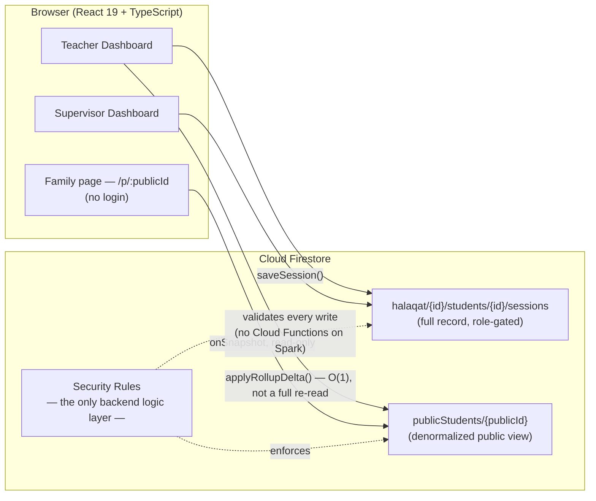

# مقرأة عبد الله بن عباس — Qur'an Memorization Tracker

A live, production Firebase + React application built for a real *maqraa* (Qur'an memorization circle) —
built to replace paper attendance/progress sheets with a role-gated web app for supervisors and teachers,
and a private, no-login QR link each family uses to follow their own child's memorization in real time.

**Live app:** https://abedallahibin3abas.web.app

> Real institution, real students, real production data — the screenshots and behavior described below
> are of the live deployed app, not a demo.

## Why this project is interesting

Most CRUD-app tutorials assume you have a backend. This one deliberately doesn't: it runs entirely on
**Firebase's free Spark plan** — no Cloud Functions, no server-side code at all. Every piece of business
logic that would normally live in an API route instead has to be either:

- expressed as a **Firestore Security Rule** (the *only* enforcement layer available), or
- run **client-side**, in a way that stays correct and fast even when 50+ students' data has to be
  aggregated for a dashboard, with no server to precompute it.

That constraint shapes almost every interesting decision in this codebase — see [Architecture](#architecture) below.

## Who uses it

| Role | What they get |
| --- | --- |
| **Supervisor** | Full control: create/edit/delete halaqat (circles) and students, provision teacher accounts, edit or delete any session, one-time "starting position" import for students who already had progress before joining |
| **Teacher** | Their own halaqa only — log a memorization or review session in seconds via cascading سورة/آية pickers, edit/delete sessions they created, see who hasn't been logged yet today |
| **Family** | A private link (`/p/:publicId`) and printable QR code — no account, no password. Live progress, streaks, and a 26-achievement progression system, updated the moment the teacher saves a session |

## Key features

- **Role-based auth** over plain Firebase Authentication (no paid Identity Platform) — usernames map to
  synthetic emails via a Firestore lookup, with a brute-force lockout state machine enforced entirely in
  Security Rules (a client can't reset its own lockout counter or forge an attempt count).
- **Real-time everywhere** — every dashboard and the public family page use `onSnapshot` listeners, not
  polling; a session saved by a teacher appears on the family's page within the same second.
- **QR-code family links** — generated the moment a student is created (not lazily on their first
  session), so the code on a freshly-printed card works immediately.
- **Cascading Qur'an pickers** — every سورة/آية selector is *populated live* from the real 114-surah,
  6236-ayah dataset, so a teacher physically cannot select ayah 50 of a surah that only has 40.
- **26-achievement progression system**, computed from real session history, not decorative placeholders.
- **One-time "starting position" import** for onboarding a student who already had real-world progress —
  deliberately *not* logged as a dated session, so it can't distort streaks or session counts.
- Hardened **Firestore Security Rules**: field-level `hasOnly()` allowlists, bounded string lengths, a
  validated evaluation enum, and a login-attempt rule that only accepts `attempts + 1` or a
  signed-in reset to `0` — never an arbitrary value a client could forge.

## Architecture



The trickiest part of the whole system is that **`publicStudents/{publicId}` is a deliberately
denormalized read-model**: the family-facing page is never allowed to read the private
`students/{id}/sessions` collection (that's exactly where phone numbers and full attendance history
live), so every session save also writes a scrubbed, aggregated public rollup — streak, sessions-count,
furthest surah/ayah reached, and a bounded list of session dates. That rollup is updated with an **O(1)
delta** (`applyRollupDelta`) on the hot path (every session save), with a full O(n) recomputation
(`recomputePublicRollupFromHistory`) reserved for the rare case — a deletion — where only replaying the
entire history can correctly determine the new furthest position and streak.

## Tech stack

- **React 19** + **TypeScript**, **Vite 7** (route-based code-splitting via `React.lazy` + vendor
  chunking for the Firebase SDK)
- **Firebase**: Firestore, Authentication, Hosting, App Check — Spark (free) plan, zero Cloud Functions
- **wouter** for routing, **Tailwind CSS v4**, **shadcn/ui** primitives
- Full **RTL Arabic** UI throughout, including RTL-aware layout, date formatting (`Intl.DateTimeFormat`
  with the Hijri calendar), and Arabic-Indic numeral formatting

## Getting started

```bash
pnpm install
cp .env.example .env   # fill in your own Firebase project's web config
pnpm dev               # http://localhost:3000
```

```bash
pnpm check   # tsc --noEmit
pnpm build   # production build (client + server)
```

### Deploying

```bash
firebase deploy --only firestore:rules,hosting
```

Requires a Firebase project with **Firestore** and **Authentication (Email/Password)** enabled, and at
least one supervisor account bootstrapped by hand in the Firebase Console on first setup (by design —
the rules only permit account creation to an *existing* supervisor, so the very first one can't be
created by the app itself).

## License

MIT — see [LICENSE](./LICENSE).
